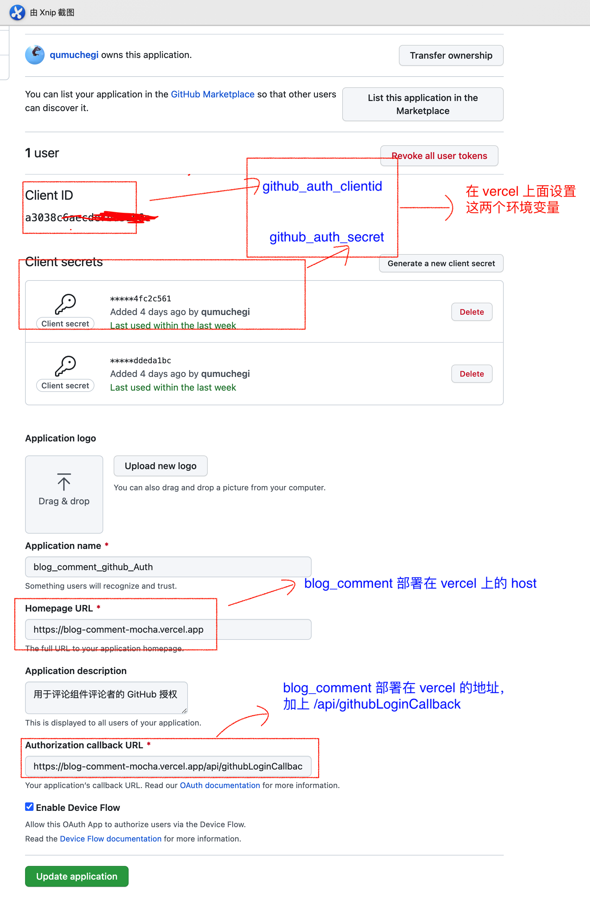

这是一个评论组件, 由 vercel/Next.js 托管, mongoDB 作为数据库，可以嵌入任意的 web 页面，前端框架无关

<a href='https://reactjs.org/versions'>
  
</a>
<a href='https://mui.com/'>
  
</a>
<a href='https://reactjs.org/versions'>
  
</a>
<a href='https://nextjs.org/'>
  
</a>
<a href='https://mongoosejs.com/'>
  
</a>

<hr/>

## feature

- [x] 基本的评论和回复、点赞功能 (已支持)

- [x] 支持 github 登录 (已支持)

- [] 主题定制 (计划中)

- [] 国际化 (计划中)

## use

1. 在 mongoDB 官网申请一个数据库集群，复制数据库连接 URL 备用.
2. fork 此项目仓库到你的 GitHub 账户.
3. 打开 [vercel dashboard](https://vercel.com/dashboard)（如果你没有 vercel 账户，先开通），在 vercel dashboard 把刚刚 fork 到 GitHub 的仓库 import 进来.
4. import 成功后，在 vercel 这个项目的设置上面设置一些环境变量，设置一个环境变量 `mongodbUrl`, 值为第 1 步你复制的 mongoDB 数据库连接 URL.

>>其他的环境变量，为了支持评论者登录 github，在 github OAuth application 设置授权 id (地址：https://github.com/settings/applications/new，可参考这篇[文章](https://www.chegi.fun/home/article-list/Code/article-content/2aa6c5b3-1b9f-4985-bbde-4ffae0b13d05) 获得 GitHub OAuth 第三方授权.
完成后复制 Client secrets 和 Client ID
，在 vercel 上面新增两个 环境变量，名字分别为 github_auth_secret 和 github_auth_clientid，值分别设置为 Client secrets 和 Client ID
 的值)，

 

5. 在 vercel 上面 deploy 即可部署完成
6. 安装 [blog_comment_frame](https://www.npmjs.com/package/blog_comment_frame), 

```shell
npm i blog_comment_frame

// or
yarn add blog_comment_frame
```

将评论组件部署完成后，在你需要引入评论组件的网页，像这样：

```js
import BlogCommentFrame from 'blog_comment_frame'

  <BlogCommentFrame
    commentDeployUrlHost={'http://xxxx.vercel.app'}
    pageId={articleId}
  />
```

commentDeployUrlHost 和 pageId、height 的用法可参考 [blog_comment_frame](https://www.npmjs.com/package/blog_comment_frame)

## issues

### 1. 尝试 react server component 遇到的问题：

遇到一个可能是和 react 18 有关的 bug，报错：`An error occurred during hydration. The server HTML was replaced with client content`， https://github.com/facebook/react/issues/22784

为解决这个问题，暂时放弃 react server component 的使用，React 退回稳定版本
